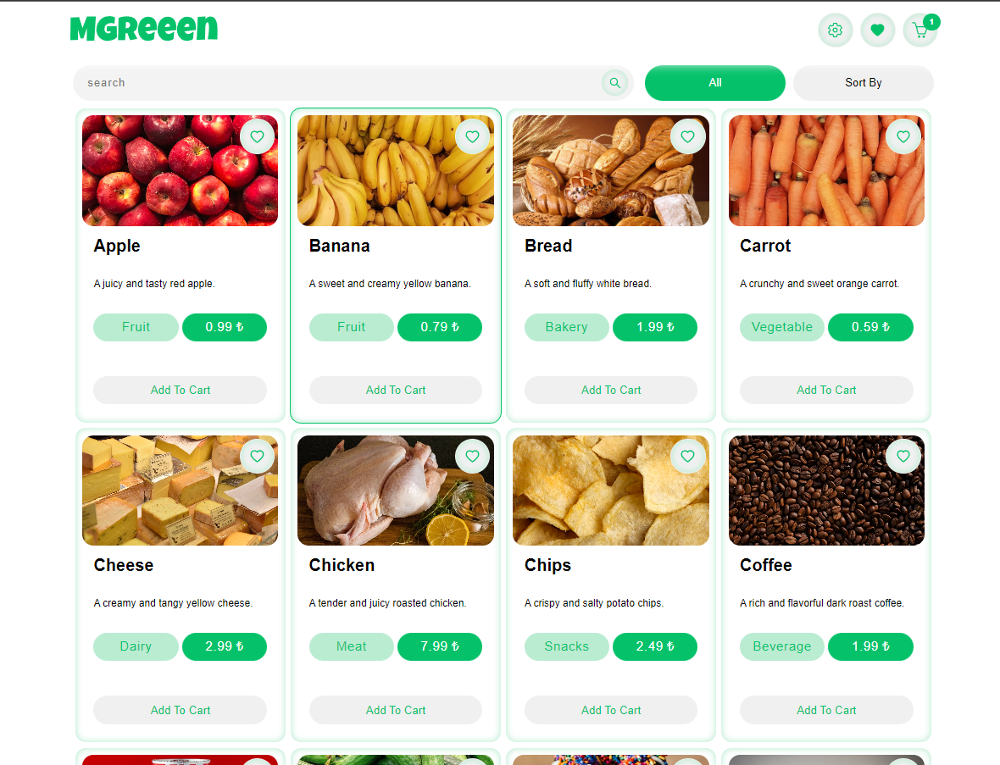
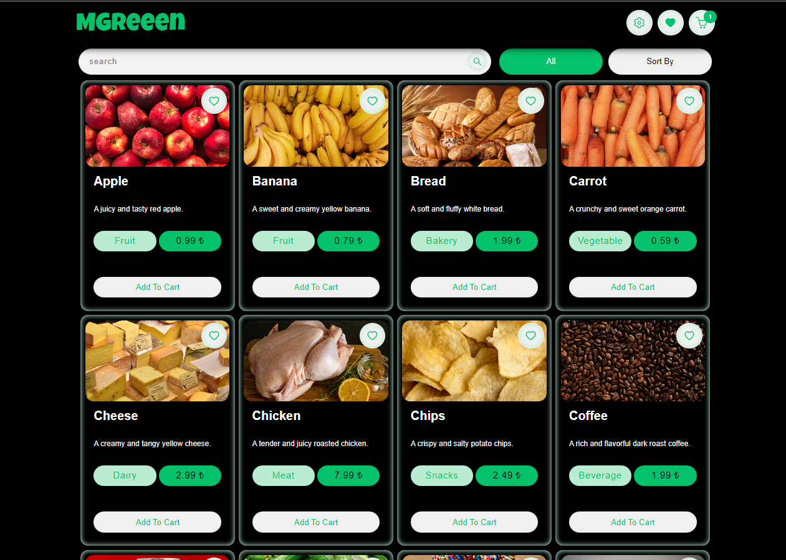
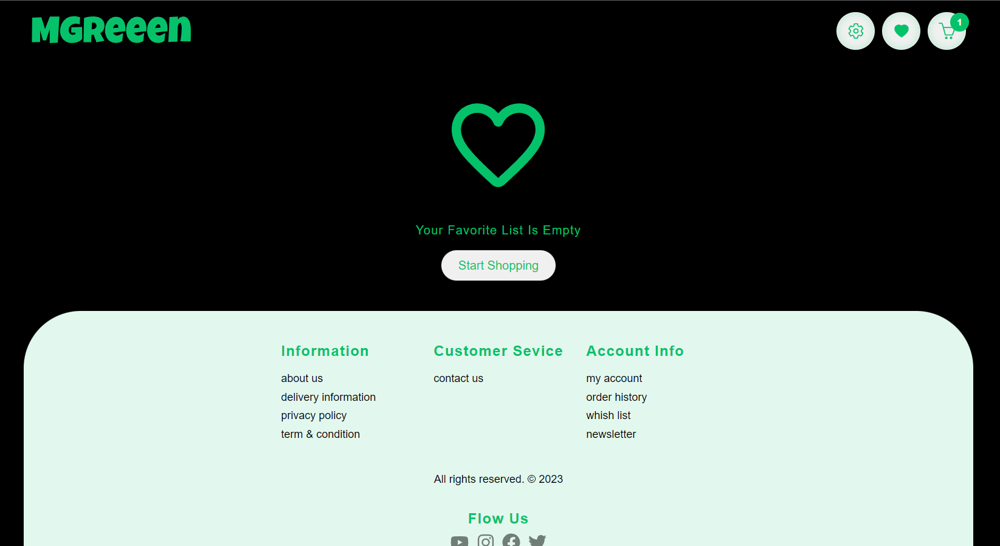
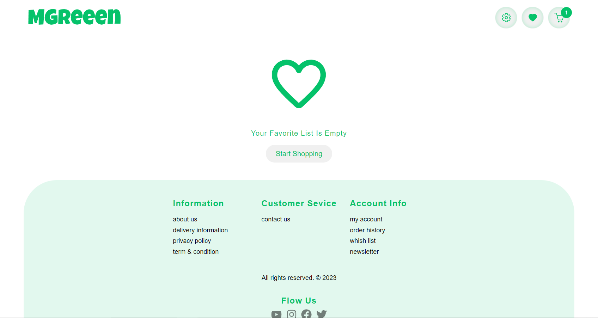
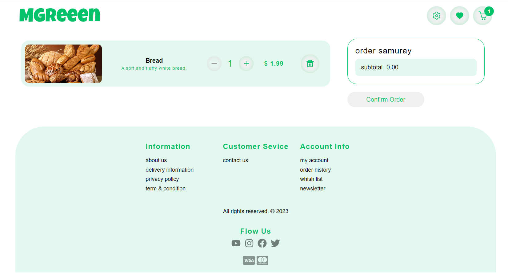
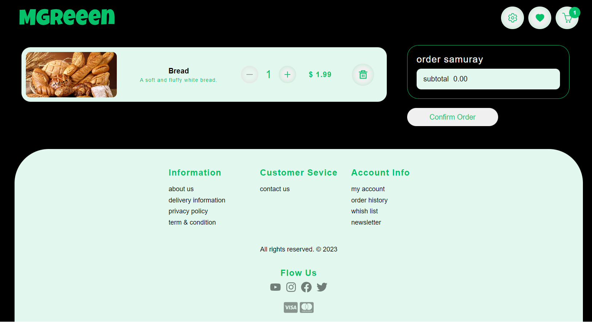
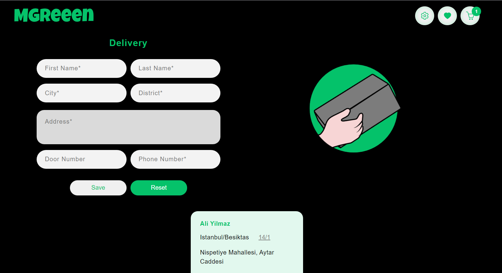
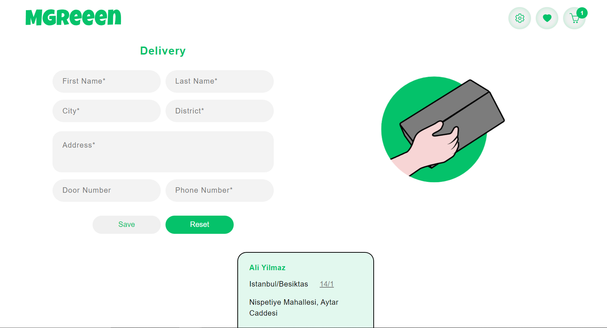

# Coino market case study

This is a case study for the mgreen market.

## Installation

To install market-coino-case, follow these steps:
Clone the repository:

```
git clone `repository_url`
```

Navigate to the project directory:

```
cd market_case_coino
```

Install dependencies:

```
npm install
```

Run the app:

```
npm run dev
```

live demo link here:
> [live link](https://market-case-coino.netlify.app/)

## website screenshots

# main page



# favorites page



# cart page



# delivery page


